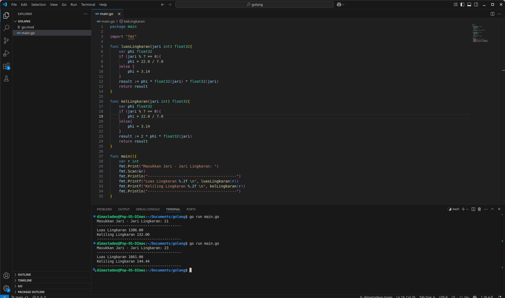

# Program luas dan keliling lingkaran dengan golang

## Berikut merupakan source code dan haril running program luas dan keliling lingkran secara interactif

### Screenshoot

program ini menggunakan bahasa pemrogaman golang, untuk hitung luas dan keliling lingkaran, ketika program dijalankan user akan diminta memasukkan jari jari lingkaran, ketika jari jari lingkaran di modulus 7 hasilnya 0 maka akan menggunakan nilai phi 22 / 7 selain itu akan pakai nilai phi 3.14. setelah user memasukkan nilai jari jari akan muncul hasil luas dan keliling lingkaran